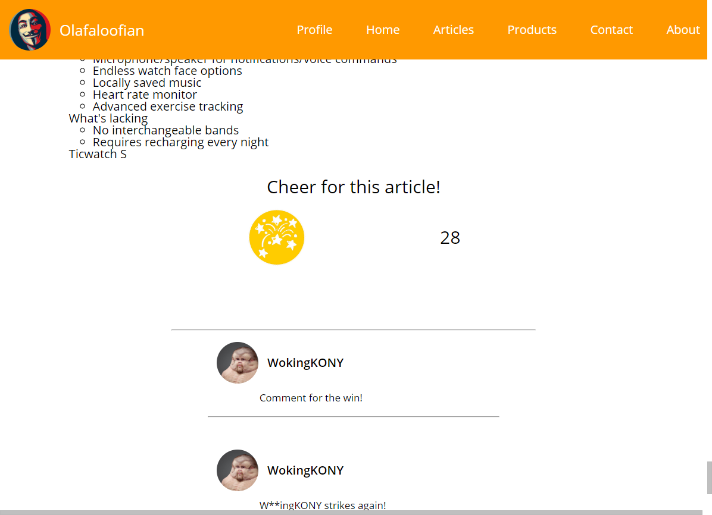
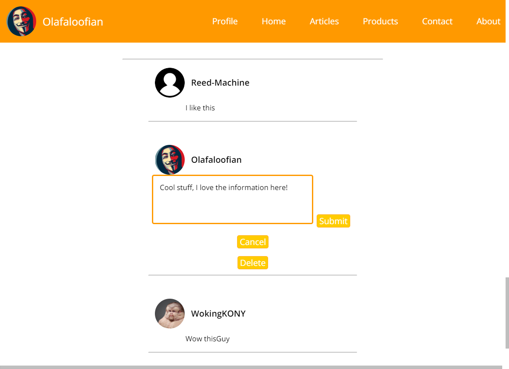
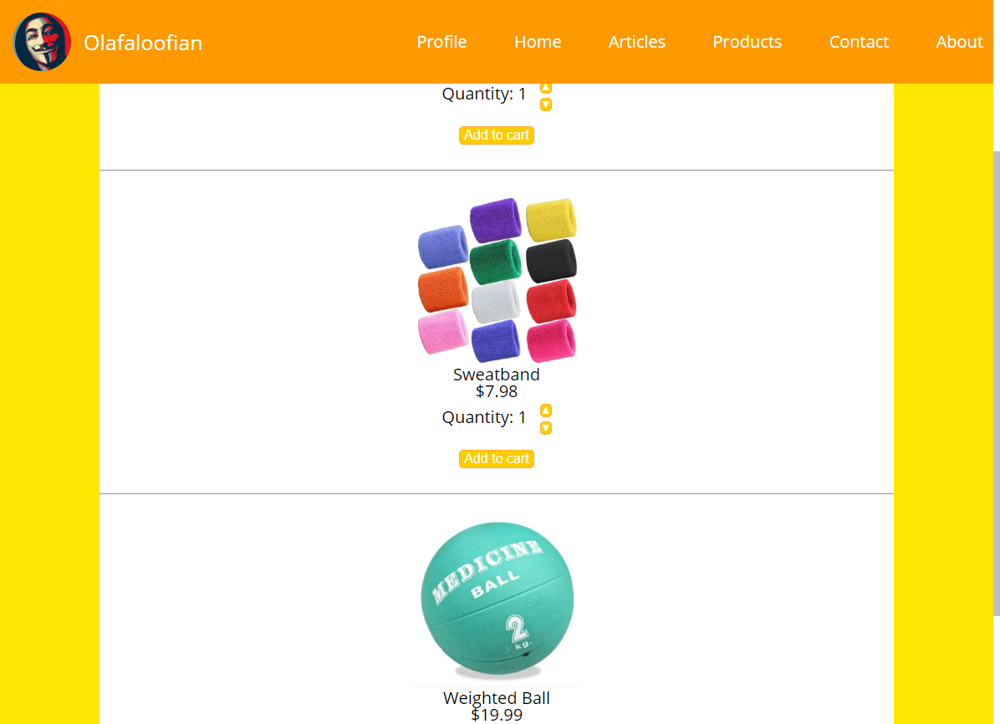
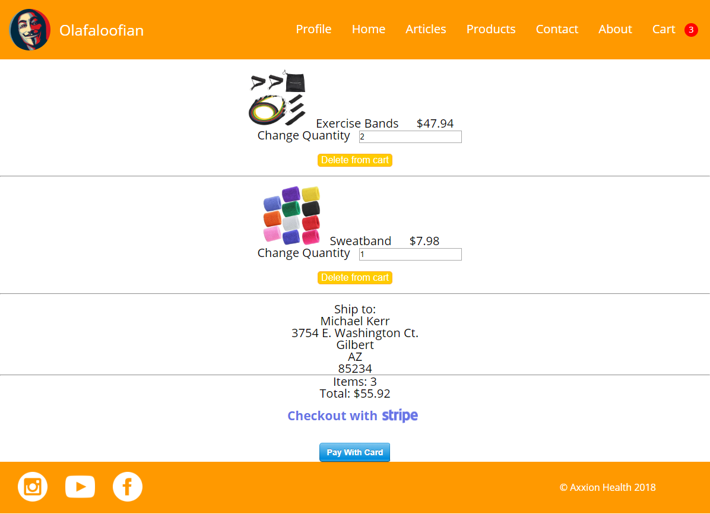

## Axxion Health is a project by web developer Michael Kerr

[Click here for the live site!](https://www.theaxxionlifestyle.com)
*To make a simulated purchase with Stripe, enter '4242 4242 4242 4242' as the card number.*

#### This website acts as a hybrid blog/e-commerce destination, allowing users to read articles, interact in the comments, and buy health-related products all in the same app.

***

### Technologies showcased in the code of this project:
- React
- Node
- PostgresQL
- Express
- Massive
- Redux
- Nodemailer
- Stripe API
- SASS
- React Router

***

### Home view

This is the landing page for Axxion Health

***

### Articles Categories

If navigated to /articles, the user will be presented with a list of article categories to help them find helpful information quickly.

***

### Articles

This is a mapped array list of all the articles in a single category.

***

### Article Body

The user has now navigated to a single article, fetched from the server using url matching parameters. This is the bottom of an article body, where the user can see comments and 'cheer' for the article to add to its cheer count.

***

### Article Comment

After logging in, users can leave comments on articles. They can also edit their previous comments. A middleware function in the server filters out restricted words, replacing them with '********'.

***

### Products List

After following a navigation path similar to articles, users see a list of products within a certain category. They have the ability to add and remove multiple items from the cart. The cart updates in real time using a combination of Redux and Session Storage.

***

### Checkout Final View

The user sees this final screen before placing an order, having previously specified the items and shipping address in earlier steps. Clicking the *Pay With Card* button will interact with Stripe's API to make a purchase. After making a purchase, a confirmation message is sent to the user's saved email using Nodemailer.

